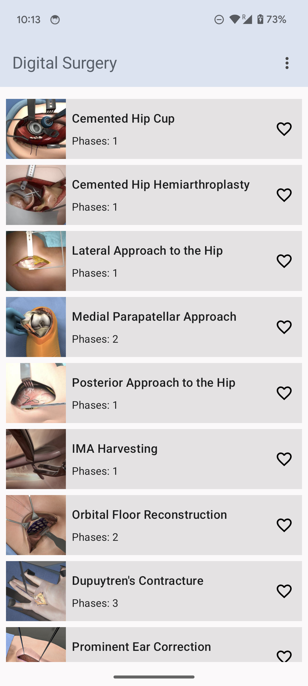
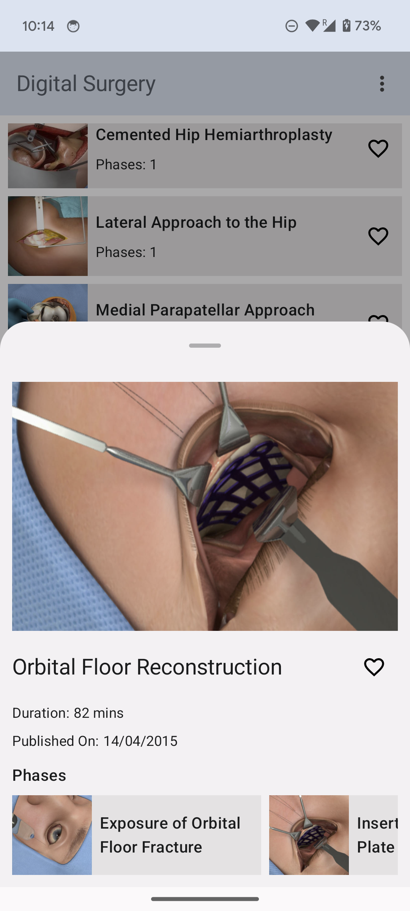
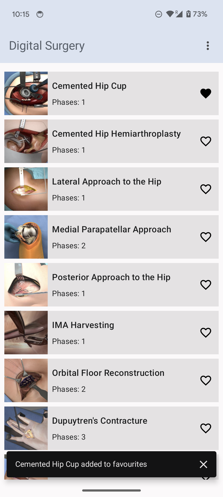
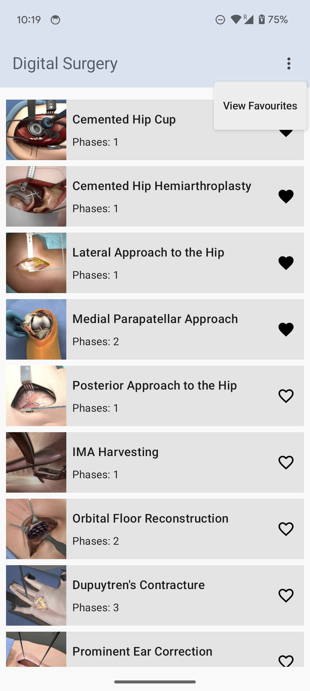
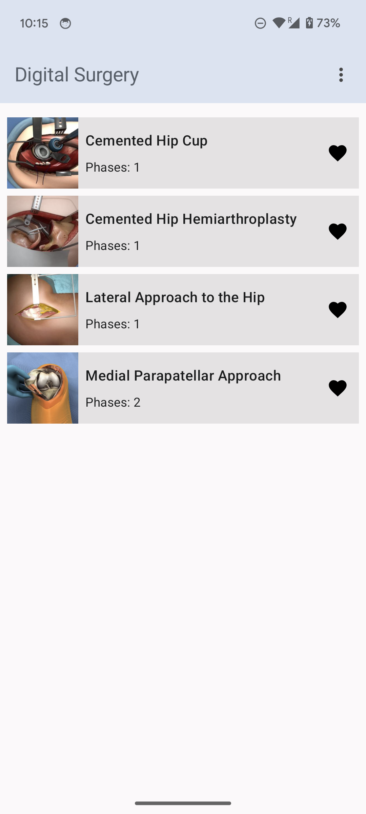

# Android application to show surgery procedures, view details and select favourites

  

    

## Architecture

This application is built using the **MVVM architecture** pattern. The separtion of concerns is implemented using Models, Views, ViewModels(and Repository).

**Views**

Views handle only the immediate interactions with the user. They only display data which they get from ViewModel.

In this application, we have three Views built using Compose UI toolkit. HomeScreen view displays the list of procedures. FavouritesScreen to show the favourites. BottomSheet to show the details of a procedure.

In the MainActivity, DigitalSurgeryApp composable is called which the Navigation host for the screens in the app.

**ViewModel**

Views make a call to ViewModel for data. ViewModel acts as a glue between View and business logic. It provides data to the View by getting it from the Repository.

In this application, ProcedureViewModel provides the data to all the views.

**LiveData**

LiveData is lifecycle aware library for creating observables. Since it is lifecycle aware it will not notify about the data changes if the View where it is observed is destroyed.

Views observe LiveData from the ViewModel to display data on the UI.

**Repository**

Repository provides data to the ViewModel. It is the single source of truth for all data i.e this layer only knows how the data is coming. The ViewModel doesn't know the source of data, it only gets the data.

In this application, ProcedureRepository is created to fetch the data from the web server and the room database. It provides the data to the ViewModel using LiveData.

**Model**

Model has the business specific data which is used by the web service to provide data to the Repository.

## Packages

**Data Storage**

- Room database is used for data storage in the app.

**Dependency Injection**

- Hilt library is used for dependency injection in the app.

**Model**

- Model classes used in the app.

**Networking**

- Retrofit Api Service
- Api models to map the api response.

**Repository**

- Repository interface and its implementation.
- Interface is created so that we can mock the implementation of Repository for testing.
- Mapper is used to map the data received from api in the required format in app.

**Screens**

- Jetpack Compose: To build the views.
- Jetpack Navigation: For navigation in the app.
- ViewModel: Common ViewModel for the views.

**Theme**

- Spacings: Custom object for spacings used in the app is added to DigitalSurgeryTheme.

**Constant**

- All the constants used in the app.

**DigitalSurgeryApplication**

- Hilt Application instance.

**Extensions**

- All extension functions created for the app.

**Unit testing**

- Mock implementation of Repository.
- Data flow from Repository to ViewModel is tested.
- LiveDataUtil class : Used this code to convert LiveData to regular data for testing.
- MainCoroutineRule: Used this code to obtain Coroutine scope in Test function.

**Note**

This app needs Internet connection to work.